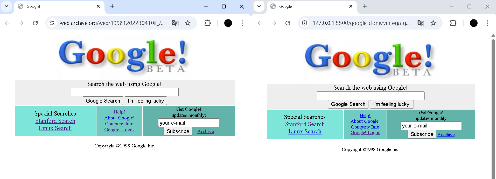

# 🔍 Google Clone (1998 & 2025)

Bu projede, Google'ın geçmişteki (1998) ve güncel (2025) iki farklı ana sayfa tasarımı klonlanmıştır.  
Hem nostaljik hem de modern arayüzleri temsil eden bu çalışma, HTML ve (internal)CSS ile hazırlanmıştır.

## 📄 Dosyalar

- `vintage-google.html` → 1998 Google klonu
- `current-google.html` → 2025 Google klonu

## 🌐 Canlı Demolar

- 🔙 1998 Versiyonu: [https://frabiakaynak.github.io/google-clone/vintage-google.html](https://frabiakaynak.github.io/google-clone/vintega-google.html)
- 🔮 2025 Versiyonu: [https://frabiakaynak.github.io/google-clone/current-google.html](https://frabiakaynak.github.io/google-clone/current-google.html)

## 🛠️ Kullanılan Teknolojiler

- HTML
- CSS

## 📷 Ekran Görüntüsü

### 🕰️ 1998 Versiyonu

### 🪄 2025 Versiyonu

